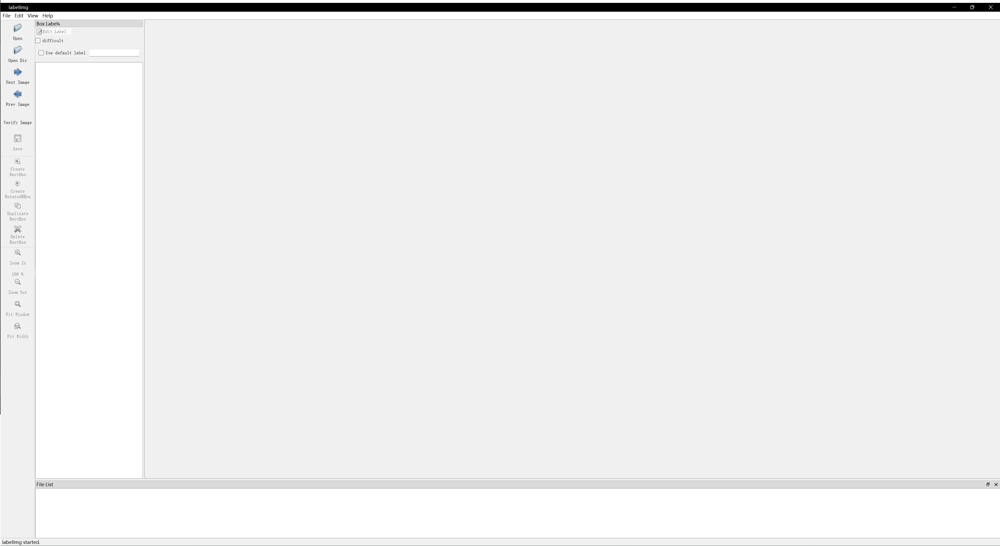

##1、打开软件
打开roLabelImg文件夹，执行roLabelImg.py文件（可能需要安装相应Python包），打开标签制作软件

##2、标签制作
根据rolabelimg.png操作说明：选择open_dir为street_img文件夹，default_save_dir为label文件夹，设置标签为sign，将电线杆上的标识牌标示出来

ps:cut_rotate_img.py文件可以将标好的矩形框进行裁剪

written by 朱
2022/10/12